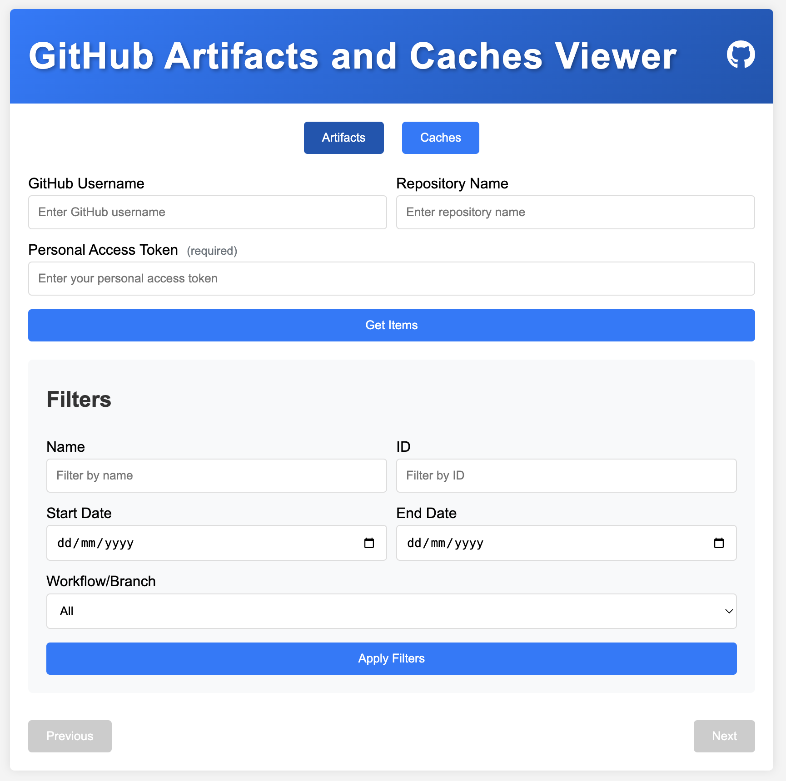

# GitHub Artifacts Viewer

[Try the GitHub Artifacts Viewer](https://bashirtowdiee.github.io/github-artifacts)

## Description

The GitHub Artifacts Viewer is a web application that allows users to view and download artifacts from GitHub repositories. It provides an easy-to-use interface for browsing artifacts, applying filters, and downloading artifact files.

## Features

- View artifacts from public and private GitHub repositories
- Filter artifacts by name, ID, date range, and workflow
- Pagination for easy navigation through large sets of artifacts
- Download individual artifacts
- Optional GitHub token support for accessing private repositories

## Prerequisites

- A modern web browser
- A GitHub account (for accessing private repositories)
- A GitHub Personal Access Token (optional, for private repositories)

## Setup

1. Clone this repository or download the source files:

   - `index.html`
   - `styles.css`
   - `script.js`

2. Place all files in the same directory.

3. Open `index.html` in a web browser.

## Usage

1. Enter the GitHub username and repository name in the respective fields.

2. (Optional) Enter your GitHub Personal Access Token if you're accessing a private repository.

3. Click "Get Artifacts" to retrieve the list of artifacts.

4. Use the filter options to narrow down the list of artifacts:

   - Filter by artifact name
   - Filter by artifact ID
   - Filter by date range
   - Filter by workflow

5. Click "Apply Filters" to update the list based on your filter criteria.

6. Use the pagination controls at the bottom to navigate through multiple pages of artifacts.

7. Click the "Download" button next to an artifact to download it.

## API Rate Limits

Please note that GitHub has API rate limits. For unauthenticated requests, the rate limit is 60 requests per hour. For authenticated requests (using a Personal Access Token), the rate limit is 5,000 requests per hour.

## Security Note

This application runs entirely in the browser. Your GitHub token, if used, is only stored in memory and is not persisted or sent anywhere other than to GitHub's API.

## Troubleshooting

- If you're unable to access a private repository, ensure you've entered a valid Personal Access Token with the appropriate permissions.
- If you encounter rate limit issues, try using a Personal Access Token or wait for the rate limit to reset.

## Contributing

Contributions to improve the GitHub Artifacts Viewer are welcome. Please feel free to submit issues or pull requests.

## License

This project is open source and available under the [MIT License](LICENSE).

## Disclaimer

This tool is not officially associated with GitHub. Use it at your own risk.
